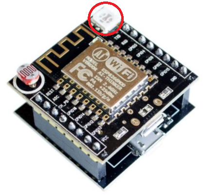

# Johnny-Five over ip application

### The intent of this little project

Is known that Johnny-five works using firmata protocol and firmata have some versions working over IP.

The intent of this project was make a workable base code to control a set of ESPs using firmata with Johnny-five and find their IP automatically on the designed subnet with their mac address.

## How to use it

1. first of all you will need a bunch of ESPs. Flash thei properly to work with arduino lenguage.
2. Upload everyone with firmata wifi code and set their to connect on your net. Catch (or set) every mac to later use.
3. Download these code and install all packages. After this you should:
    * find and change the **ip** property of **netConf**
    * change the **macs** list of the **netConf** to contain all ESPs mac address

## Results
|   |   |
|---|---|
| After these configuration just run the main.js file with your **node** our througth **npm start** the board used to test code was a **ESP-12F MINI nodemcu**. After a little while of scan all blue leds should turn on and stay like these until the code as closed| Nodemcu MINI |

